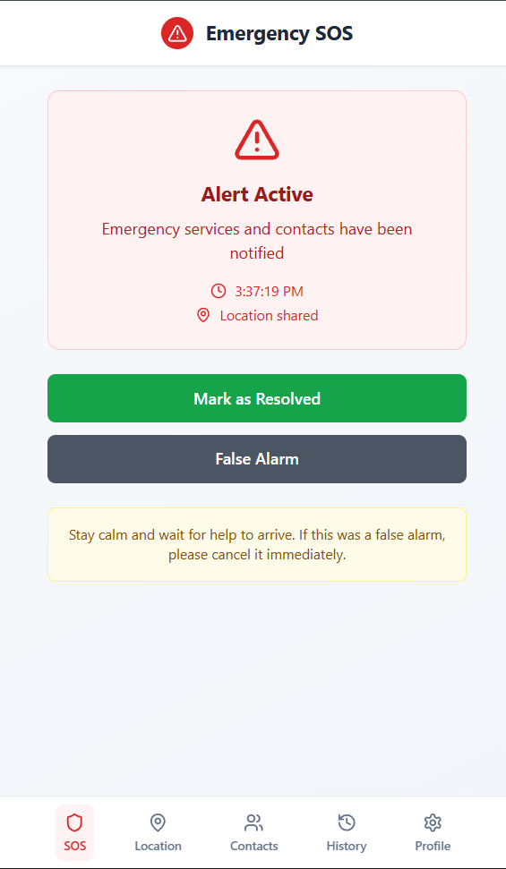
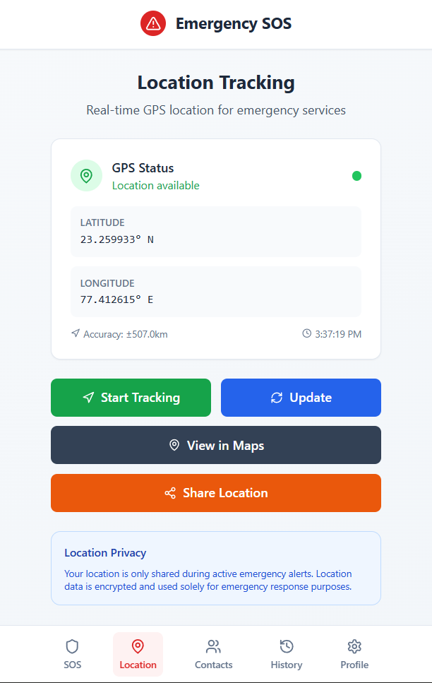
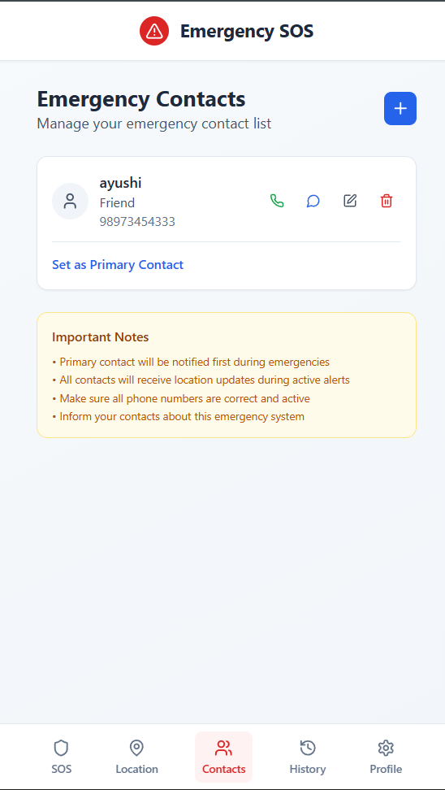

 ### SOS Alert

1. Distress Button Screen 

The **Distress Button** screen appears when the user activates the SOS feature.
It confirms that emergency services and selected contacts have been notified, and provides quick options to manage the situation.

**Key Highlights:**

* **Alert Active** – Indicates that the SOS alert is currently active.
* **Time &  Location** – Displays the exact time of activation and confirms that the live location has been shared.
* **Mark as Resolved** – Ends the alert and informs contacts that you are safe.
* **False Alarm** – Cancels the alert immediately if it was triggered accidentally.
* **Safety Tip** – Reminds you to stay calm and wait for help unless the alert was a mistake.

This screen ensures the user knows help is on the way and can take immediate action to stop the alert if needed.

2. Location Tracking Screen

This screen displays the **real-time GPS location** of the user for emergency services during an active SOS alert.

**Features shown on this screen:**

* **GPS Status** – Indicates whether the device’s location is available.
* **Latitude & Longitude** – Shows the exact coordinates of the user’s current position.
* **Accuracy & Timestamp** – Displays the location accuracy and the time it was recorded.
* **Start Tracking** – Begins continuous location updates for responders.
* **Update** – Refreshes the location data manually.
* **View in Maps** – Opens the location in a map application for better navigation.
* **Share Location** – Sends the user’s location to selected contacts.
* **Location Privacy Notice** – Ensures that the location is only shared during emergencies and is encrypted for safety.

**Purpose:**
Helps emergency responders and contacts pinpoint the user’s location quickly, improving the chances of timely assistance.

3. Emergency Contacts Screen

This screen allows the user to **manage their emergency contact list** so help can be quickly dispatched when the SOS feature is triggered.

**Features shown on this screen:**

**Contact Card** – Displays the name, relationship, and phone number of the contact.
 **Call / Message / Email Icons** – Provide quick access to contact them directly.
 **Delete Option** – Remove a contact from the emergency list.
**Set as Primary Contact** – Marks one contact as the first to be notified during emergencies.
 **Add Contact Button** – Allows adding new emergency contacts.

**Important Notes Section:**

* The primary contact is always notified first.
* All contacts receive live location updates during active alerts.
* Ensures phone numbers are correct and active.
* Advises informing contacts about the emergency system in advance.

**Purpose:**
Enables the user to keep their emergency contacts updated, ensuring that help can be reached quickly and accurately during emergencies.

